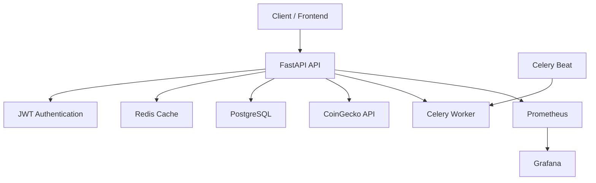
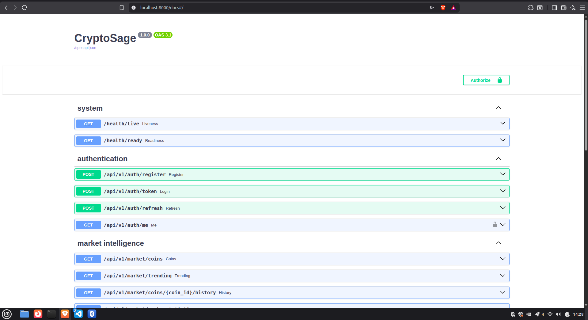

# 🚀 CryptoSage

<div align="center">

### Production-ready Cryptocurrency Analytics Backend

Built with **FastAPI • PostgreSQL • Redis • Celery • Docker • Prometheus • Grafana**


</div>

---

## 🌍 Live Demo

> Coming soon — deployment to Railway / AWS.


## Contents

- [Overview](#-overview)
- [Highlights](#-highlights)
- [Architecture](#-architecture)
- [API Preview](#-api-preview)
- [Run Locally](#-run-locally)
- [Core API](#-core-api)
- [Operations](#-operations)
- [Quality Checks](#-quality-checks)
- [Documentation](#-documentation)

  
## 📖 Overview

CryptoSage is a production-ready cryptocurrency analytics platform built to demonstrate modern backend engineering practices.

The project combines authentication, asynchronous APIs, PostgreSQL persistence, Redis caching, Celery background workers, Docker-based deployment, Prometheus metrics, and Grafana dashboards into a scalable backend architecture.

Rather than serving as a simple CRUD application, CryptoSage focuses on production-ready design, observability, and maintainability.

---

## ✨ Highlights

- 🔐 JWT authentication with Argon2 password hashing and refresh tokens
- 🚀 Redis cache-aside strategy with scheduled invalidation
- 📈 CoinGecko-powered cryptocurrency market intelligence
- 📊 Portfolio analytics with holdings and unrealised P&L
- 🔄 Celery workers for scheduled background processing
- 📡 WebSocket market streaming
- 📉 Prometheus metrics and Grafana dashboards
- 🐳 Docker Compose deployment
- 🧪 16 automated tests with 92%+ coverage

---

## 📊 Repository Metrics

| Metric | Value |
|--------|------:|
| API Version | v1.0.0 |
| Python | 3.12 |
| Automated Tests | 16 |
| Test Coverage | 92.07% |
| Docker Services | 7 |
| API Documentation | OpenAPI 3.1 |

## 🏗 Architecture


## 📸 API Preview



---

## 🚀 Run Locally

```bash
git clone https://github.com/zaytec/CryptoSage.git
cd CryptoSage

cp .env.example .env

docker compose up --build
```

## 🌐 Local Services

| Service | URL |
|----------|-----|
| Swagger UI | http://localhost:8000/docs |
| Health Check | http://localhost:8000/health/live |
| Readiness Check | http://localhost:8000/health/ready |
| Prometheus | http://localhost:9090 |
| Grafana | http://localhost:3000 |

> **Production Note**
>
> Before deploying:
>
> - Set `ENVIRONMENT=production`
> - Generate a strong `SECRET_KEY`
> - Configure explicit CORS origins
> - Use non-default PostgreSQL credentials
> - Run `alembic upgrade head`
> - Configure `/health/live` and `/health/ready` as health checks


## Core API

- `POST /api/v1/auth/register`, `/token`, `/refresh`
- `GET /api/v1/market/coins`, `/trending`, `/coins/{coin_id}/history`
- `POST /api/v1/portfolios`; `POST /api/v1/portfolios/{id}/transactions`
- `GET /api/v1/portfolios/{id}/analytics`
- `WS /ws/market/{currency}` for live market snapshots; clients may send `ping`.

Market data is cached with endpoint-appropriate TTLs (60 seconds for prices, 180 for trending, 600 for historical data). Redis failures degrade gracefully for read endpoints, while readiness correctly reports dependency failures.

## Operations

Run schema migrations with `alembic upgrade head`. The Compose stack starts API, Celery worker/beat, PostgreSQL, Redis, Prometheus, and Grafana. Put the provided NGINX configuration in front of the API in an internet-facing deployment. Railway and AWS deployments should supply all values from `.env.example` through their secret managers, run `alembic upgrade head` as a release command, and expose `/health/live` and `/health/ready` to the platform health checks.

## Quality checks

```bash
pip install -e '.[dev]'
ruff check .
pytest
docker compose config
```

The suite covers authentication, caching, persistence, WebSockets, Celery tasks, and health/metrics. The release baseline is 16 passing tests and 92.07% coverage. Actual local benchmark results are documented in [docs/BENCHMARKS.md](docs/BENCHMARKS.md).
---

## 📚 Documentation
| Guide | Description |
|-------|-------------|
| [Architecture](docs/ARCHITECTURE.md) | System design and component interactions |
| [API Reference](docs/API.md) | Endpoint reference |
| [Deployment Guide](docs/DEPLOYMENT.md) | Production deployment guide |
| [Benchmarks](docs/BENCHMARKS.md) | Performance measurements |
| [Release Notes](docs/RELEASE_NOTES.md) | Version history |


---

## ⭐ Support

If you found this project useful, consider giving it a ⭐ on GitHub.

---

Built with ❤️ using FastAPI, PostgreSQL, Redis, Celery, Docker, Prometheus, and Grafana.
